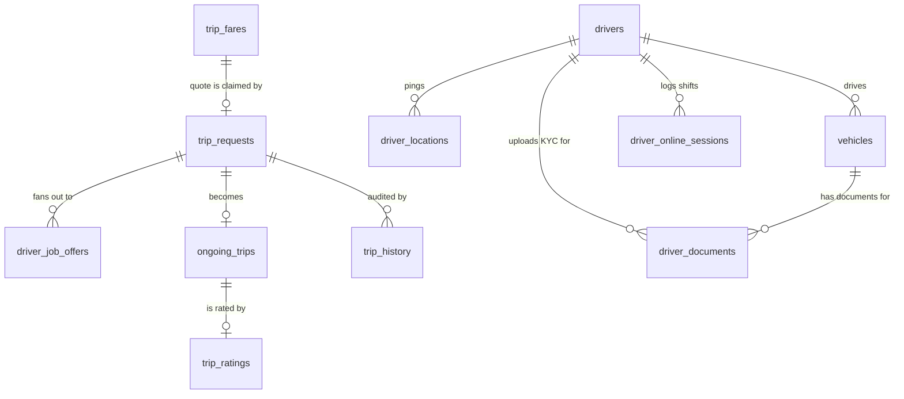

# Go Ride — Database Schema

The single source of truth for **Go Ride**'s database: versioned SQL migrations and matching GORM models, published as a tagged Go module and imported by every other service in the platform. Nobody else defines their own table.

<p align="center">
  
  
  
  
</p>

## Why a separate repo

Six `go.mod` files across two repos (**[go-ride-backend](https://github.com/shawon-kanji/go-ride-backend)**, **[go-ride-kafka-consumers](https://github.com/shawon-kanji/go-ride-kafka-consumers)**) import this module at their own pinned version. A schema change ships here first — migrated, tagged — and only then do consumers bump the dependency, **as its own commit, separate from the feature code that uses it**. That ordering (database first, code second) is what keeps a deploy always valid mid-rollout.

## The schema, as a lifecycle

The core tables model a trip's authority moving between them as it progresses — a quote, then a search, then a real trip — rather than one row mutating through every state:



| Table | Role |
|---|---|
| `users` / `drivers` | Separate identity tables — riders and drivers are not a shared model |
| `trip_fares` | A locked price quote; exists before any trip does |
| `trip_requests` | A search in progress; authoritative from booking until a driver accepts |
| `ongoing_trips` | A real trip with a real driver; authoritative from acceptance onward |
| `driver_job_offers` | The fan-out table — one row per driver offered a job |
| `trip_history` | Append-only audit log spanning the whole lifecycle |
| `driver_locations` | Every driver's latest GPS ping — geospatially indexed (see below) |
| `vehicles` / `driver_documents` | Fleet + two-track KYC (driver identity docs, per-vehicle docs) |
| `fare_configs` / `fare_surcharges` | Versioned, effective-dated pricing rules by city + tier |

## A schema decision worth knowing about

`driver_locations.s2_cell_id` stores the **leaf-level [S2](https://github.com/golang/geo) cell ID** as `NUMERIC(20,0)` — not `VARCHAR` (a `BETWEEN` on strings is lexicographic, silently wrong for ranges) and not `BIGINT` (unsigned 64-bit S2 IDs can exceed Postgres's signed max). This is what lets `go-ride-kafka-consumers`' nearest-driver dispatch query run as an indexed numeric range scan instead of a full-table Haversine computation on every attempt. Full story: [`go-ride-kafka-consumers/docs/engineering-challenges.md`](https://github.com/shawon-kanji/go-ride-kafka-consumers/blob/main/docs/engineering-challenges.md#1-geospatial-nearest-driver-search-with-no-postgis).

## Usage in sibling repos

```bash
go get github.com/shawon-kanji/go-ride-db-schema@vX.Y.Z
go mod tidy
```

Commit the `go.mod`/`go.sum` bump on its own, separate from the feature code that depends on the new schema. A local `replace` directive is fine while developing against unreleased migrations, but should be a real tag before merging.

## Commands

```bash
go run ./cmd/migrate up        # or: down, version
make seed-fare-config          # idempotent baseline fare_configs for local/test
make test
```

Env vars: `DB_HOST` (`localhost`), `DB_PORT` (`5432`), `DB_USER` / `DB_PASSWORD` (`postgres`), `DB_NAME` (`go_ride`), `DB_SSLMODE` (`disable`) — see `.env.example`.

## Conventions

- **Migrations are the source of truth.** Sequential, paired `NNNNNN_description.{up,down}.sql` files, embedded into the binary. `models/` structs are hand-kept in sync by convention — there's no ORM auto-migration in either direction.
- **Every model** has an explicit `TableName()`, a `uuid.UUID` primary key (`gen_random_uuid()` default), pointer types for nullable columns, and status/enum-like columns backed by exported Go `const` blocks matching a SQL `CHECK` constraint — not a Go enum type.
- CI spins up a real Postgres 16 and runs `migrate up` + `migrate version` on every push — that's the correctness check for schema changes, not unit tests (there are none, by design; the migration round-trip *is* the test).

## Deployment

No Dockerfile, Helm chart, or CI/CD of its own — `cmd/migrate` is run by whichever consuming service's pipeline is deploying, against that environment's database, as a precondition before rollout. See [`go-ride-infra`](https://github.com/shawon-kanji/go-ride-infra)'s `docs/architecture.md` for the full picture.
